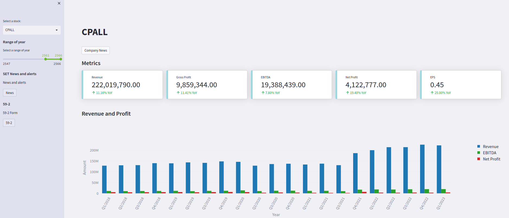
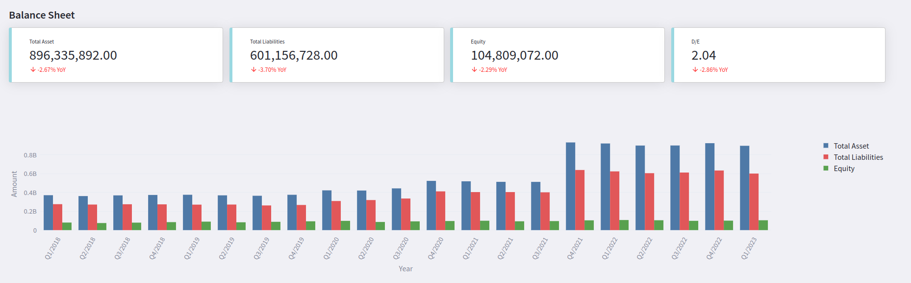
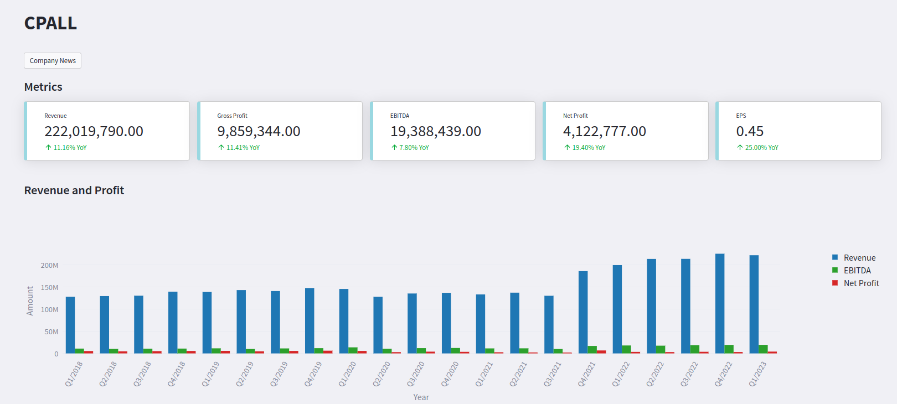
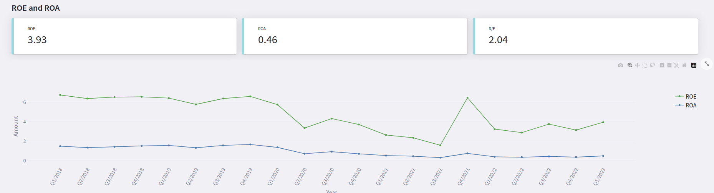
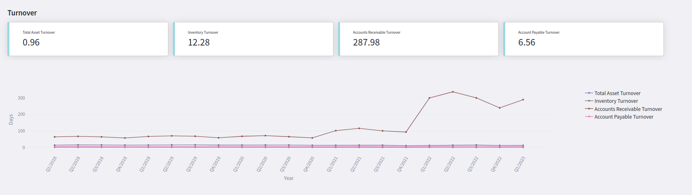

# streamlit-TH-stock



This project is apply using streamlit to build the  interactive dashboard 
for visualize the thai equity performance

## Table of Contents

- [Installation](#Installation)
- [Run the app](#run-the-app)
- [File and Folder Description](#File-and-Folder-Description)
- [Feature](#Feature)


# Installation
you have to install streamlit, pandas, plotly 

```bash
pip install streamlit 
pip install pandas 
pip install plotly
```

then make the directory of TH-stock.TH-stock folder 
should contain csv file in each period of time

```bash
mkdir TH-data
```

# Run the app

To run the application run the following command in terminal

```bash
streamlit run dashboard.py
```

# File and Folder Description

1. dashboard.py
    -   This file is the main file that run the dashboard
2. setupfile.py
    -   This file setup the csv file that combine all csv file in TH-data folder.This file also clean the data into the right format
3. config folder
    -   This folder contain config color of the plot 
4. feature folder
    -   This folder contain all feature view 
5.


# Feature

- Balance Sheet

- Cash Cycle

- Cash Flow

- EPS

- Gross Margin ,EBIT Margin , Net Margin

- Revenue and Profit

- ROE ROA

- Turnover

 